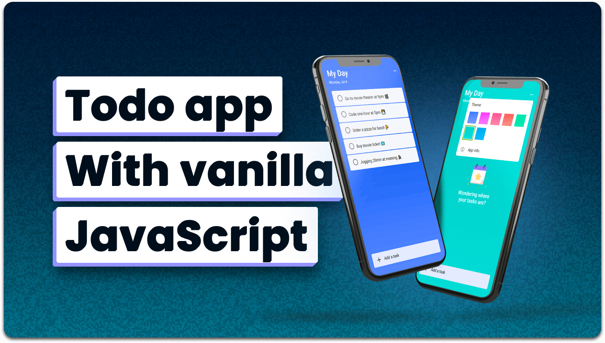

<div align="center">

# ✅ ToDoBuddy

**A clean, minimal, and fully responsive to-do list application.**

Built with HTML · CSS · JavaScript

[](#license)

<br />



</div>

---

## 📖 About

ToDoBuddy is a lightweight task management app designed for simplicity and speed. It runs entirely in the browser with zero dependencies — no frameworks, no build tools, just clean vanilla code.

Whether you need a quick daily planner or a distraction-free way to track tasks, ToDoBuddy gets out of your way and lets you focus.

---

## ✨ Features

- **Add & Remove Tasks** — Quickly add tasks and mark them complete or delete them
- **Task Completion Animation** — Satisfying visual feedback with sound effect on task completion
- **Theme Customization** — Choose from 7 built-in color themes to personalize the UI
- **Dynamic Date Display** — Automatically shows the current day and date
- **Responsive Design** — Works seamlessly on desktop, tablet, and mobile devices
- **Welcome State** — Friendly empty-state illustration when no tasks exist
- **App Info Modal** — Built-in modal with version and project details
- **Keyboard Support** — Press `Enter` to quickly add tasks

---

## 🛠️ Tech Stack

| Technology | Purpose |
|------------|---------|
| **HTML5** | Semantic page structure |
| **CSS3** | Custom properties, responsive layout, animations |
| **JavaScript (ES6)** | DOM manipulation, event handling, local logic |
| **Google Fonts** | Roboto typeface |
| **Ionicons** | Icon library for UI elements |

---

## 🚀 Getting Started

### Prerequisites

- [Git](https://git-scm.com/downloads) installed on your system
- Any modern web browser (Chrome, Firefox, Edge, Safari)

### Installation

1. **Clone the repository**

   ```bash
   git clone https://github.com/abhnvkanth/TodoBuddy.git
   ```

2. **Navigate to the project directory**

   ```bash
   cd TodoBuddy
   ```

3. **Open in browser**

   Simply open `index.html` in your browser, or use a local server:

   ```bash
   npx serve .
   ```

   Then visit `http://localhost:3000`

---

## 📁 Project Structure

```
TodoBuddy/
├── assets/
│   ├── css/          # Stylesheets
│   ├── images/       # UI illustrations
│   ├── js/           # Application logic
│   └── sounds/       # Task completion audio
├── readme-images/    # Screenshots for README
├── favicon.svg       # Browser tab icon
├── index.html        # Main application page
├── style-guide.md    # Design tokens & color reference
└── README.md
```

---

## 🎨 Themes

ToDoBuddy supports 7 color themes out of the box. Click the menu icon (⋯) in the top-right corner to switch between them.

---

## 📄 License

This project is **free to use** — no license restrictions.

